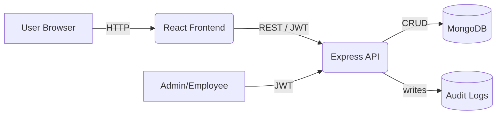
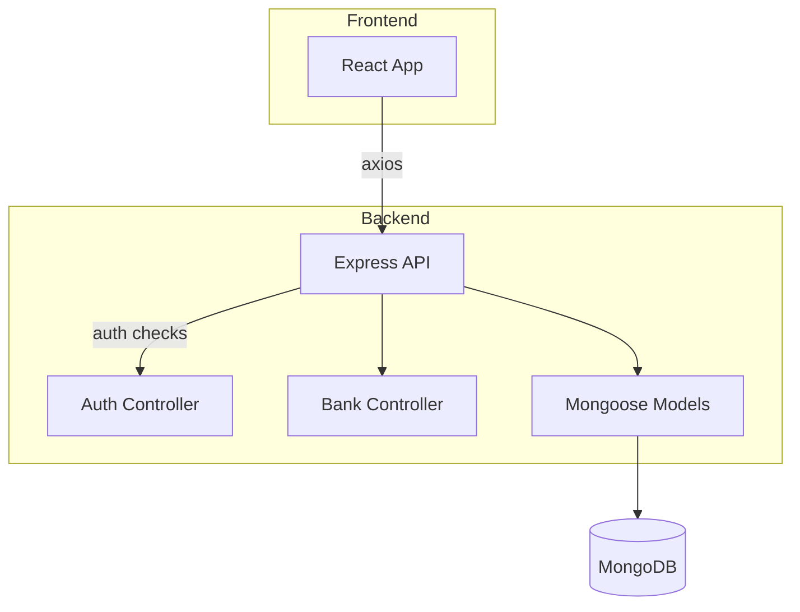
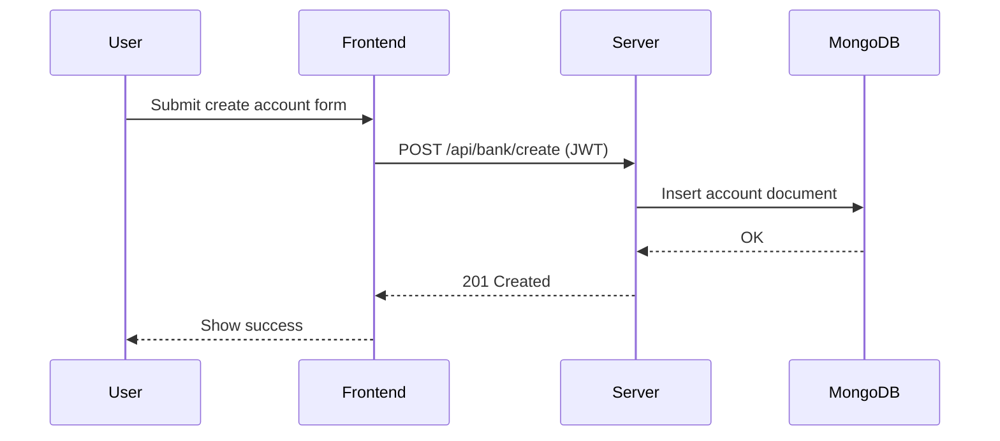

# Express Banking System

A full-stack example banking system: React frontend, Express API, MongoDB persistence, and JWT-based authentication.

---

Table of Contents
- [About](#about)
- [Features](#features)
- [Tech Stack](#tech-stack)
- [Quick Start (interactive)](#quick-start-interactive)
- [Environment Variables](#environment-variables)
- [Running & Scripts](#running--scripts)
- [API Overview](#api-overview)
- [Database & Seeders](#database--seeders)
- [Architecture & DFDs](#architecture--dfds)
- [Testing](#testing)
- [Contributing](#contributing)
- [FAQ](#faq)

---

## About

This repo implements a simplified banking platform with user accounts, transactions, deposits, withdrawals, and role-based features for employees/managers. It's useful as a learning project, demo, or starting point for production work after hardening and auditing.

## Features

- User registration/login with hashed passwords and JWT
- Account creation (SAVINGS / CHECKING) and per-account operations
- Transfer funds, deposit, withdraw, and transaction history
- Role-based routes (employee, manager) and protected endpoints
- Input validation, rate limiting, and basic audit logging

## Tech Stack

- Frontend: React, React Router, Axios
- Backend: Node.js, Express
- Database: MongoDB (Mongoose)
- Auth: JWT, bcryptjs
- Dev & Tools: nodemon, dotenv

## Quick Start (interactive)

1. Copy the example env and install dependencies:

```bash
cp .env.example .env
npm install
```

2. Start development server (backend + frontend if configured):

```bash
npm run dev
```

3. Quick interactive checks
- Open `http://localhost:3000` in your browser to use the UI.
- Use the API with `curl` or Postman. Example login flow:

```bash
# Register (if you don't have a user)
curl -X POST http://localhost:5000/api/auth/register \
	-H "Content-Type: application/json" \
	-d '{"name":"Alice","email":"alice@example.com","password":"Password123"}'

# Login
curl -X POST http://localhost:5000/api/auth/login \
	-H "Content-Type: application/json" \
	-d '{"email":"alice@example.com","password":"Password123"}'
```

After login you'll receive a JWT; add it to `Authorization: Bearer <token>` for protected endpoints.

Tip: set `ENABLE_QUICK_LOGIN=true` in `.env` to enable any built-in quick-login helper (if implemented).

## Environment Variables

Copy `.env.example` to `.env` and edit values. Reference (from `.env.example`):

```env
PORT=5000
MONGO_URI=mongodb://127.0.0.1:27017/express_bank
JWT_SECRET=replace_with_strong_secret
CLIENT_URL=http://localhost:3000
REACT_APP_API_URL=https://express-banking-system.onrender.com/api
ENABLE_QUICK_LOGIN=false
```

Security: never commit secrets. Use a secrets manager or CI environment variables in production.

## Running & Scripts

- `npm install` — install dependencies
- `npm run dev` — start both backend and frontend in dev mode (if configured)
- `npm run server` — start backend only
- `npm start` — start production server
- `npm run seed` — run project seeders (see `scripts/`)

Example: start server locally

```bash
npm install
npm run server
```

## API Overview

Authentication

- `POST /api/auth/register` — register new user
- `POST /api/auth/login` — login and receive JWT

Bank endpoints (require `Authorization: Bearer <token>`)

- `POST /api/bank/create` — create an account
- `GET /api/bank/accounts` — list user's accounts
- `POST /api/bank/transfer` — transfer between accounts
- `POST /api/bank/deposit` — deposit funds
- `POST /api/bank/withdraw` — withdraw funds
- `GET /api/bank/balance/:accountNumber` — get balance
- `GET /api/bank/transactions/:accountNumber` — transaction history

For full request/response shapes, inspect the controllers in `controllers/` and models in `models/`.

## Database & Seeders

- Local DB: set `MONGO_URI` to your local MongoDB instance.
- Seed admin user:

```bash
node scripts/seedAdmin.js
```

- Fix admin role if needed:

```bash
node scripts/fixAdminRole.js
```

## Architecture & DFDs

High-level data flow (Level 0):



Component diagram (simplified):



Sequence (create account):



These diagrams are editable — you can paste them into Mermaid live editor for tweaks.

## Testing

- Unit / integration tests: see `src` and `server` tests (if any)
- To run prepared tests (when present):

```bash
npm test
```

## Contributing

- Fork the repo, create a feature branch, open a PR with tests and a clear description.
- Keep commits small and focussed. Use conventional commit messages if possible.

## FAQ

- Q: Where are environment settings?
- A: See `.env.example` at the project root.

---

If you'd like, I can also:

- generate a Postman collection from the API routes
- add a dedicated `docs/` folder with rendered Mermaid diagrams and PNG exports
- create GitHub Actions to run tests and lint on PRs

Which of these would you like next?